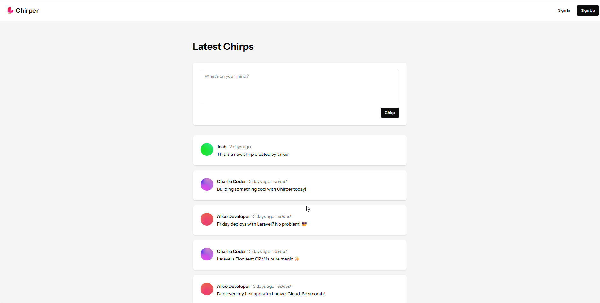

<div align="center">
  <br />
  <a href="" target="_blank">
    
  </a>
  <br />

  <div>
    
  
  
  


  </div>

  <h3 align="center">Chirper — A Mini Twitter Clone</h3>

  <div align="center">
    A simple social media platform built with Laravel and Blade, where users can sign up, post chirps, and interact with the latest feed!
  </div>
</div>

## 📋 Table of Contents

1. ✨ [Introduction](#introduction)
2. ⚙️ [Tech Stack](#tech-stack)
3. 🔋 [Features](#features)
4. 🤸 [Quick Start](#quick-start)

---

## ✨ Introduction

Chirper is a lightweight social media application built using **Laravel**, **Blade Components**, and **TailwindCSS**. Users can register, post messages (chirps), edit or delete their chirps, and view other users’ posts in a clean, modern feed.

---

## ⚙️ Tech Stack

- **[Laravel](https://laravel.com/)** — PHP framework for web development, handling routing, models, controllers, and Blade templates.
- **[Blade](https://laravel.com/docs/10.x/blade)** — Templating engine used for building dynamic, reusable UI components.
- **[TailwindCSS](https://tailwindcss.com/)** — Utility-first CSS framework for responsive and customizable design.
- **[SQLite](https://www.sqlite.org/index.html)** — Lightweight relational database used for storing users and chirps.
- **[PHP](https://www.php.net/)** — Server-side scripting language powering the application.

---

## 🔋 Features

- **User Authentication**: Sign up, log in, and log out securely.
- **Post Chirps**: Create new chirps with a maximum of 255 characters.
- **Edit & Delete Chirps**: Users can manage their own posts.
- **Feed**: View latest chirps from all users, sorted by newest first.
- **Timestamps**: Chirps display when they were created and edited.
- **Responsive Design**: Works across mobile, tablet, and desktop devices.
- **Avatar System**: Each user has an avatar generated from their email; anonymous posts show a default avatar.

---

## 🤸 Quick Start

Follow these steps to set up the project locally.

### Prerequisites

- [PHP >= 8.0](https://www.php.net/)
- [Composer](https://getcomposer.org/)
- [SQLite](https://www.sqlite.org/index.html) (or another supported database)

---

### Cloning the Repository

```bash
git clone https://github.com/Pasan-pramu/chirper.git
cd chirper
